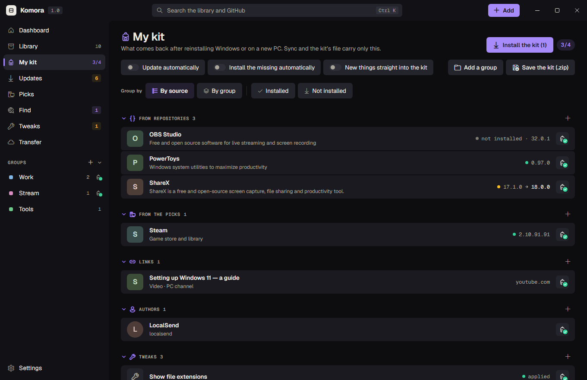
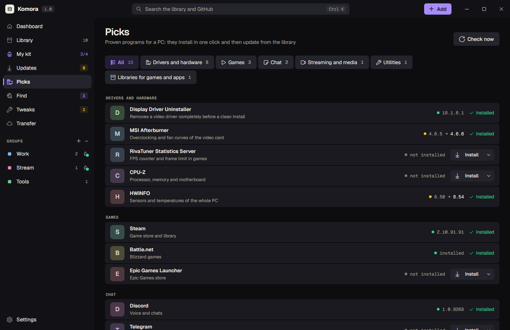

# Komora

**Українська** · [English](README.md)

Власна комора софту для Windows 11. Програми й посилання, якими користуєшся, — в одній бібліотеці з групами, тегами й
нотатками; програми встановлюються й оновлюються просто з релізів на GitHub, GitLab чи Codeberg, а повсякденні програми
для ПК можна вибрати в **Добірці** й поставити через winget. Познач програми, що мають бути на кожному твоєму ПК, як
**Мій набір** — і новий ПК отримає їх одним кліком. Komora живе в треї й сама перевіряє нові версії.

<p align="center">
  
</p>
<p align="center">
  
  
</p>
<p align="center">
  
  
</p>

## Можливості

- **Мій набір.** Що повернути після перевстановлення Windows чи на новому ПК: програми, посилання, групи, автори, за
  якими стежиш, і твіки — на окремій сторінці, за джерелом чи за групами, встановлені чи ні, «Встановити набір» для
  відсутніх. Огляд підказує, чи можна перевстановлювати Windows зараз: чи синхронізовано набір, чи не лишилися поза ним
  встановлені програми. Фіолетова позначка кладе програму в набір із рядка бібліотеки, її сторінки, результатів GitHub
  або перетягуванням на «Мій набір»; група може сама додавати в набір усе, що в неї кладеш. Набір може сам оновлювати
  свої програми й сам ставитися на новому ПК, коли приходить із синхронізацією чи файлом набору; синхронізація й zip
  набору несуть лише набір.
- **Добірка.** Близько 70 перевірених безкоштовних програм для ПК за категоріями — драйвери й інструменти для заліза,
  ігрові лаунчери, спілкування, стрім і медіа, утиліти, браузери, бібліотеки — встановлюються, оновлюються й
  видаляються через winget, з поступом завантаження, кнопкою скасування й текою на вибір. Те, що вже стоїть на ПК, саме
  з'являється в бібліотеці — з версією, значком і тим, що про програму каже winget.
- **Цей ПК.** Огляд показує Windows, процесор (мікроархітектура, ядра, потоки, L3), відеокарти (тип пам'яті, шина,
  зайнята відеопам'ять), модулі пам'яті, плату з BIOS і кожен диск (модель, NVMe чи SATA, PCIe, SSD чи HDD, місце) —
  наживо, поки Огляд відкритий, — із посиланнями на драйвери й BIOS на сайтах виробників. Версії й коди копіюються
  кліком; серійні номери — на вимогу.
- **Бібліотека програм і посилань.** Встав репозиторій GitHub, GitLab чи Codeberg або будь-яке посилання (Ctrl+V або перетягни у вікно) —
  Komora підтягне назву, справжній значок програми, опис і README. Групи, теги, нотатки; мертві посилання
  позначаються.
- **Встановлення й оновлення з релізів.** GitHub, GitLab і Codeberg: Потрібний файл для цього ПК (архітектура, встановлювач чи портативна),
  перевірка контрольної суми й підпису, тихі встановлювачі (Inno Setup, NSIS, MSI, WiX), своя тека для встановлювачів і
  портативних, закріплена версія, пропущені релізи, відкат портативних, старіші релізи одним кліком. Komora так само
  оновлює й себе.
- **Перевірка за таймером.** Щодня, щотижня чи щомісяця, умовними запитами (ETag), зі сповіщенням Windows і журналом
  знайденого. Тестові релізи — для однієї програми або для всіх.
- **Безпека.** Підпис Authenticode, SHA-256 проти релізу, VirusTotal: пошук за хешем, а з твоїм безкоштовним ключем API
  кожне встановлення перевіряється само, невідомі файли вивантажуються.
- **Один пошук.** Бібліотека, групи й теги та GitHub разом — із шапки вікна; «Знайти» — Добірка, пошук на GitHub із
  фільтрами, готовими наборами, приростом зірок за тиждень і нещодавніми запитами, і пошук на GitLab. Форки проєкту й
  котрий із них живіший.
- **Автори.** Стеж за користувачем чи організацією GitHub і бач їхні нові репозиторії.
- **Твіки й виправлення Windows.** Каталог перемикачів і свої (значення реєстру чи PowerShell), кожен можна скасувати;
  Komora помічає, коли оновлення Windows їх скидає. Виправлення одним кліком: кеш шейдерів відеокарти, тимчасові файли,
  годинник, кеш DNS, кеші Microsoft Store й оновлень Windows, системні файли Windows (sfc і DISM); білим ярликам ігор
  Steam, перенесених на інший диск, повертаються значки.
- **Перенесення.** Один файл набору з бібліотекою, групами, тегами, нотатками й твіками; zip несе ще копії налаштувань
  програм і саму Komora.exe. Поділитися добіркою програм посиланням (секретний GitHub Gist) чи текстом, а бібліотеку
  тримати однаковою на всіх твоїх ПК через секретний Gist.
- **Копії налаштувань.** Komora сама знаходить, де програма тримає налаштування, копіює ці теки й гілки реєстру перед
  кожним оновленням і раз на день, якщо вони змінилися, і зберігає п'ять останніх копій.
- **Вигляд.** Власна шапка вікна, фіолетовий акцент і шість тл — темні обсидіан, графіт і північ, світлі сіре, біле й
  пісок — шрифт Geist, світла / темна / як у Windows. Дев'ять мов: українська, англійська, німецька, французька,
  іспанська, португальська, польська, італійська й турецька.

## Вимоги

Windows 10 чи 11 (x64 або ARM64) із WebView2 (у Windows 11 вбудований); Добірці потрібен winget («Інсталятор
застосунків», у Windows 11 вбудований). Токен GitHub — за бажанням: без нього GitHub
дає 60 запитів на годину, з ним 5000; синхронізації й поширенню через Gist потрібен токен із дозволом Gists.

## Збірка

```
cargo build --release
```

Rust stable з MSVC. Сторінка вікна (`web/`) і шрифти вшиваються в exe.

## Стан

1.0.0. Перевірено наживо: бібліотека, пошук на GitHub, перевірка оновлень, встановлення портативних, «Мій набір», zip
набору з копіями налаштувань, шапка вікна, дані про залізо на Огляді, знаходження встановлених програм Добірки й
встановлення їх через winget. Ще не перевірено на справжніх системах: встановлювачі всіх видів, оновлення й відкати,
встановлення з GitLab і Codeberg, синхронізація й поширення через Gist, оновлення самої Komora, виправлення,
вивантаження у VirusTotal. Повідомлення — в Issues.

## Підтримати

<p align="center">
  <a href="https://send.monobank.ua/jar/6VR4c6nxzz"></a>
</p>

Komora безкоштовна. Якщо вона тобі корисна, можеш підтримати: [банка monobank](https://send.monobank.ua/jar/6VR4c6nxzz).

## Ліцензія

GPL-3.0 — див. [LICENSE](LICENSE). Шрифти Geist і Geist Mono — SIL Open Font License 1.1
([web/fonts/OFL.txt](web/fonts/OFL.txt)).
